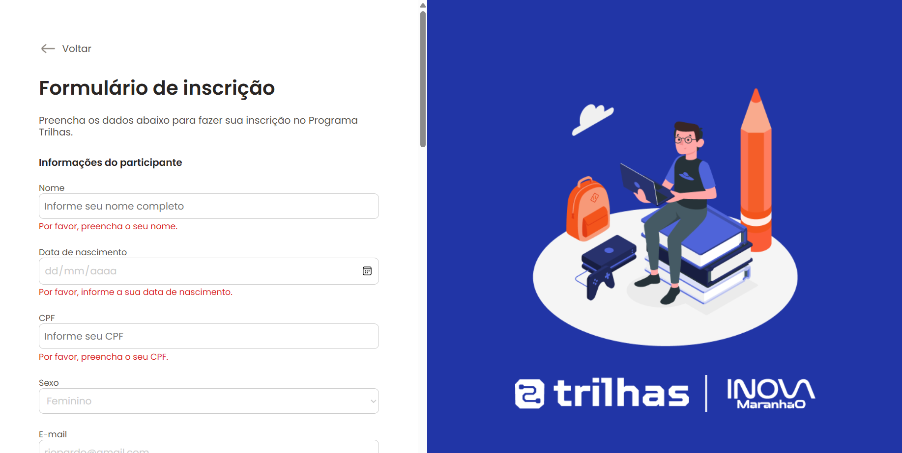

# 📝 Sistema de Inscrição - Programas de Inovação da SECTI

Este projeto é um esboço de sistema para a realização de inscrições nos programas de inovação ofertados pela **Secretaria Estadual de Ciência, Tecnologia e Inovação do Maranhão (SECTI)**. A plataforma foi idealizada para permitir que jovens interessados possam se inscrever de maneira simples, segura e eficiente.

---

## 📌 Sobre o Projeto

A proposta do sistema é oferecer uma solução web acessível e intuitiva para que os candidatos possam realizar suas inscrições nos programas promovidos pela SECTI.

**Objetivo**:  
Criar uma plataforma exclusiva para o cadastramento e recebimento de inscrições, voltada para o público jovem (entre 16 e 25 anos) que tenha concluído ou esteja cursando o ensino médio.

---

## 🚀 Como rodar o projeto localmente

1. **Clone o repositório**
2. **Acesse a pasta do projeto**
3. **Abra o arquivo `index.html` no navegador:**

Você pode simplesmente dar um duplo clique no arquivo ou usar uma extensão como **Live Server** no VS Code para rodar localmente.

---

## 🛠️ Tecnologias utilizadas

O sistema foi desenvolvido utilizando tecnologias web simples e acessíveis, com foco em usabilidade e validação de dados:

- **HTML5** — Estrutura do sistema e dos formulários  
- **CSS3** — Estilização e responsividade das páginas  
- **JavaScript (vanilla)** — Funcionalidades, validações e armazenamento local dos dados

---

## 🎯 Principais funcionalidades

### ✅ Cadastro de usuário
- Criação de um ID de usuário e senha
- Confirmação de senha
- Validação de preenchimento e mensagens de erro
- Armazenamento temporário no `LocalStorage`

### ✅ Login
- Validação do ID e senha previamente cadastrados
- Autenticação simples via `LocalStorage`
- Exibição de mensagem de erro caso o login esteja incorreto

### ✅ Formulário de inscrição
- Campos obrigatórios:
  - Nome completo
  - Data de nascimento
  - CPF ou documento de identificação
  - Sexo
  - E-mail
  - Telefone
  - Endereço completo (CEP, rua, número, bairro, cidade, estado)
- Upload de arquivos:
  - Documento de identificação
  - Comprovante de residência
- Seleção da trilha de aprendizagem desejada
- Confirmação dos "Termos e Condições" e "Política de Privacidade"
- Validação de cadastro informando usuário e senha.

### ✅ Validações implementadas
- Verificação do preenchimento de todos os campos
- Validação de e-mail (presença do `@`)
- Exibição de mensagens de erro em campos inválidos
- Salvamento temporário dos dados preenchidos
- Confirmação final da inscrição com alerta de sucesso

---

## 📸 Imagens

Página de cadastro de usuário e senha:

Página de inscrição

---

## 🧑‍💼 Público-alvo

- Jovens entre 16 e 25 anos que tenham concluído ou estejam cursando o ensino médio
- Equipe técnica da SECTI responsável pela manutenção e gestão do sistema

---

## 🤝 Contribuição

Contribuições são bem-vindas!  
Sinta-se livre para abrir issues e enviar pull requests com sugestões de melhorias ou correções.